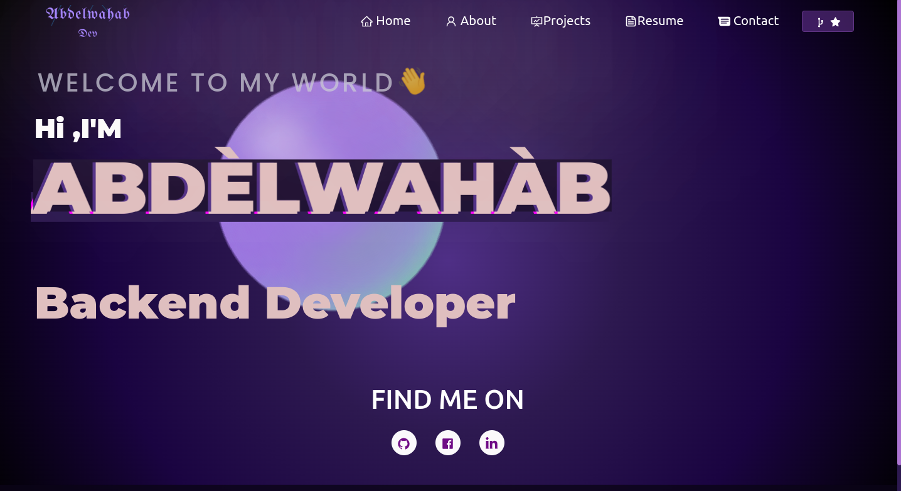
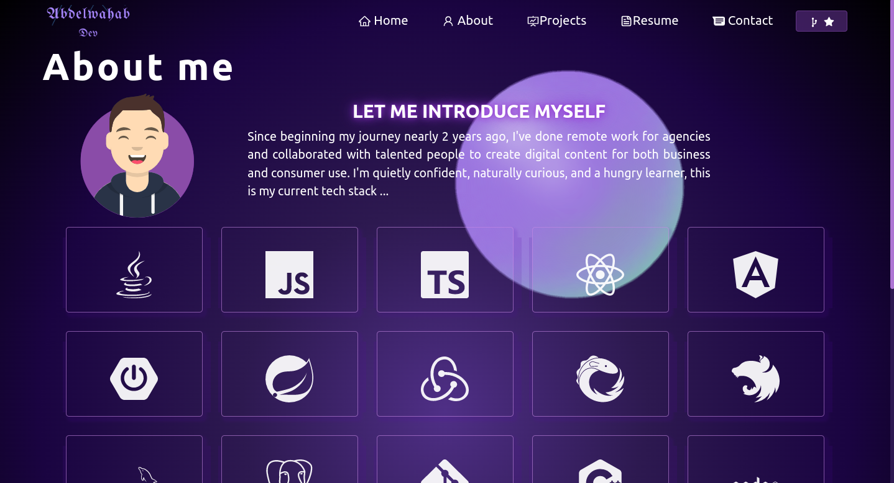
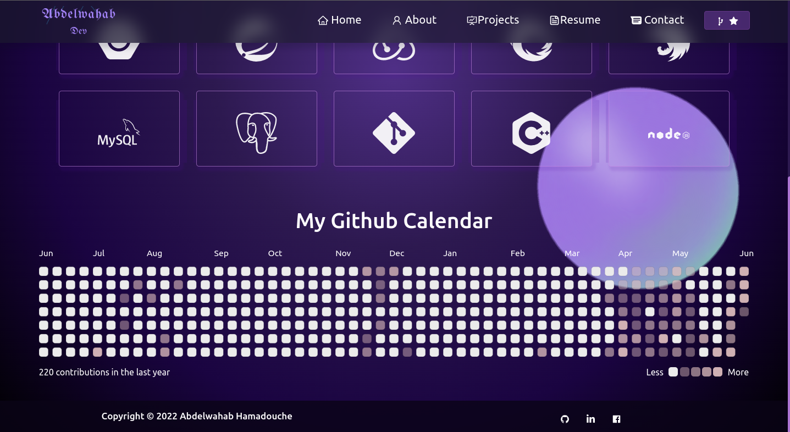
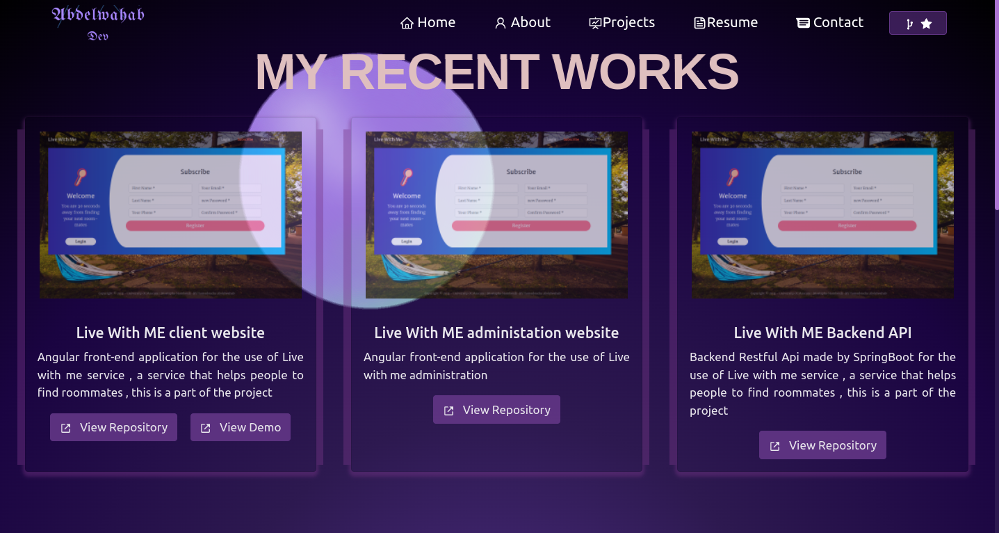
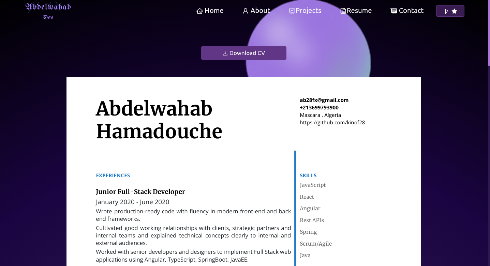
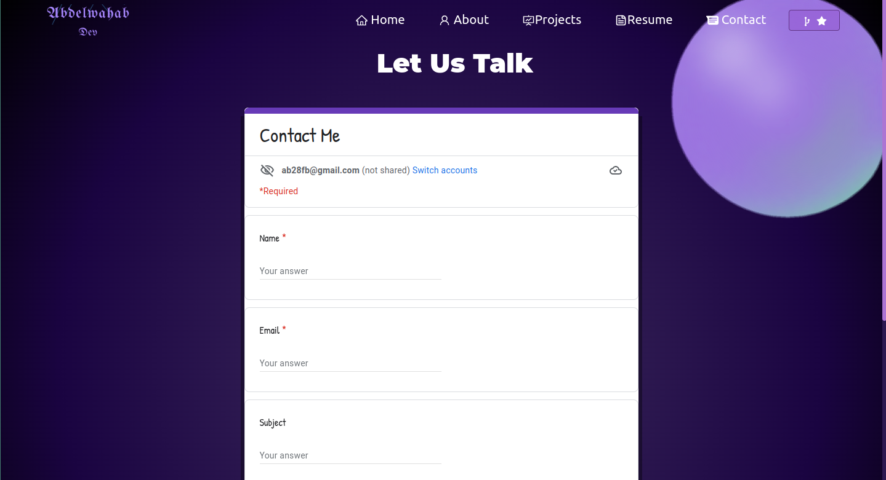
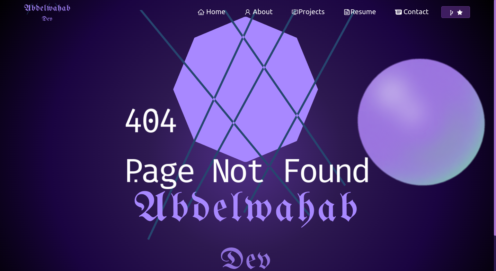

# React Portfolio

## [DEMO](https://abdelwahab-hamadouche.netlify.app/)

This project was created by React , front-end framwork and without typescipt this is javascript react application 
 
this portfolio contains some animations by react spring and css usual animation
 
and it is totaly static web site so u can deploy it on netlify as i did or github or any static web server 
 
it is static cause I don't want to pay for it to be alive  😅 😅

## Pages
this portfolio contains:
### Home Page

### About Page

### Projects Page

### Resume Page

### Contact Page

### 404 not found Page

## How to use it

Just clone the repository and run 
### npm install 
If u had a problem with installing dependencies just run :   npm install --legacy-peer-deps    and that should be it  
after that run 
### npm start
and it should be runing on ur local server on port 3000 as any usual react application 

## Copyright

to use for personal website just change the name and links and the list of projects since it is a static datastructure 
and give me a star  😌   
Don't forget to put your own form informations 😑

  
that's all have fun 😉😉
